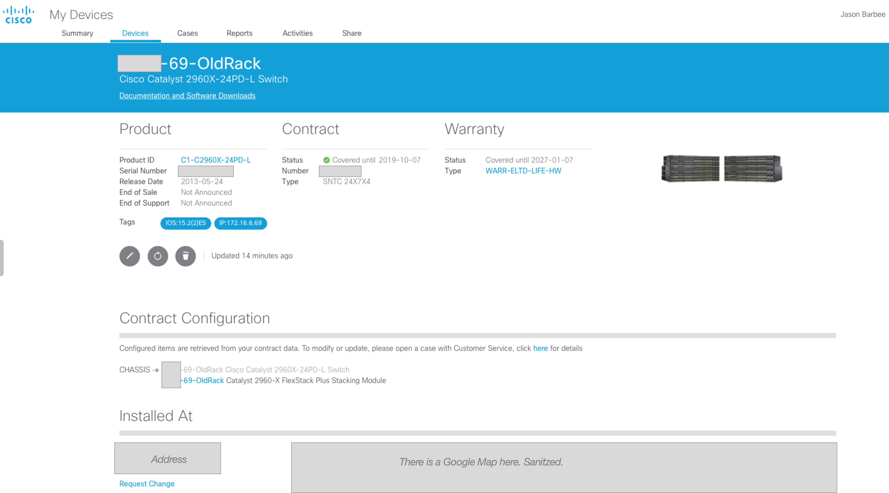
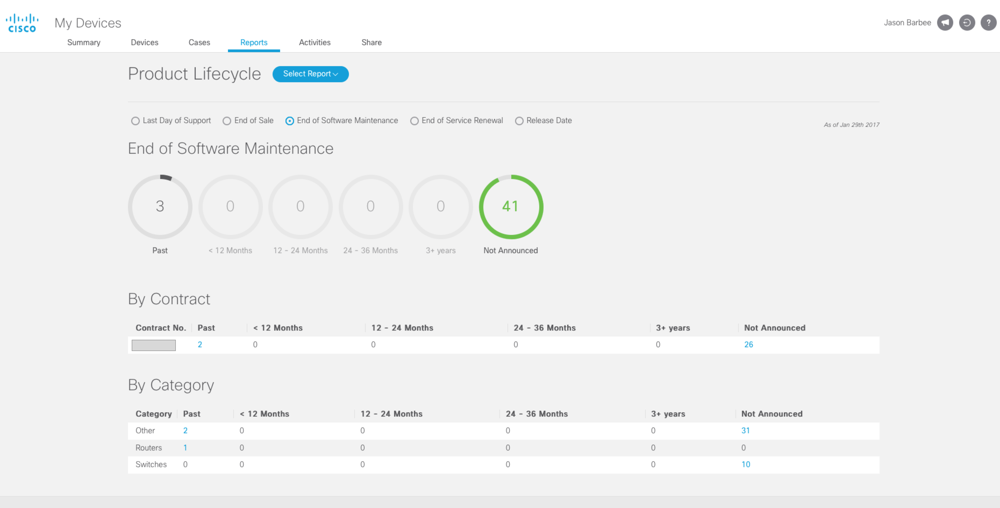

# Ansible Cisco Inventory
For onboarding a network to Cisco My Devices or Cisco TotalCare FAST and EASY.
For people who don't have time to install a collector, discover subnets, deal with SNMP issues, etc.

## Goal: Help Make Cisco Inventories easier and automated.

## Why use this?
1. You onboard the device once - add it to Ansible inventory. No SNMP or discovery guess work.
2. Automation - Go ahead and use Ansible for other things.
3. No data leaves the network other than the CSV.
4. Easy EOX reports and contract renewal quoting for customers.
5. Easy IOS version reports via Tagging or CSV export.
6. Onboard customers to Cisco Totalcare without expensive Scanners or complicated Collectors.
7. Assessment tooling to run mass commands and backups for auditing your network.

## Easy way - Docker
I have build a Docker image that has everything pre-built and ready to literally run a single command(maybe two) to scan a list of IPs.

```
docker pull jasonbarbee/ansible-cisco-inventory
docker run -it -v $(pwd):/ansible/mnt jasonbarbee/ansible-cisco-inventory:latest
ansible-playbook -i mnt/myinventoryfile cisco-mydevices.yml

```
Quick explanation of what's going on there- 
-v mounts a local folder as a volume
$(pwd) returns the local path you are in to mount it to the /ansible/mnt folder inside docker.
the -it calls for an interactive session (bash shell)
CAUTION: If you are new to Docker.... Docker containers do not SAVE any data except in the shared volume area.

Let's say you have a folder on your desktop for inventories. You can mount that and use the Docker Ansbile to reference that, and just run the host file inventory tool inside the container.

Docker will write a mydevices.csv file inside the container. This will not persist past your session, you must copy this out. 
I plan to address this in the near future with a environment variable...TODO.

For now, take the mydevices.csv output and copy it to the mount folder.

```
cp mydevices.csv mnt
```

## To install on Ubuntu - you need Ansible and NTC-Ansible
1. Install Ansible
http://docs.ansible.com/ansible/intro_installation.html

2. Install NTC-Ansible into the working folder with this playbook.
https://github.com/networktocode/ntc-ansible

    * Option 1 usually works best.
One simple way to fix Ansible paths for this to work is to create a new folder for this repo, then clone this repo into it.
```git clone https://github.com/networktocode/ntc-ansible --recursive```

Example that should work every time
```
$ git clone https://github.com/networktocode/ntc-ansible.git --recursive
$ wget https://github.com/jasonbarbee/ansible-cisco-inventory/archive/master.zip ansible-inventory.zip
$ unzip master.zip
$ cp ansible-cisco-inventory/* ntc-ansible
$ cd ntc-ansible
```

Test your NTC Code library paths. If it does not work, my script will not work. 
If you get a working Help Document from this command you are good to go.
```
$ ansible-doc ntc_file_copy
```

### Install NTC-Ansible Depedencies
```
pip install ntc-ansible
sudo apt-get install zlib1g-dev libxml2-dev libxslt-dev python-dev
pip install terminal
```

# Now to Configure Ansible
This does not use SNMP. It is a CLI parsing tool. So as long as we can login via SSH, we are good.
These modules **require SSH**. 
You can use Ansible and Telnet to provision SSH. But there's too much tooling outside my control that is hard wired for SSH only.
(NetMiko supports it. PyNTC and NTC-Ansible does not).
An example - config playbook (config-ssh.yml) is included if you need some guidance on bulk enabling ssh through telnet.

See the FAQ below on enabling Telnet Hack to PyNTC if this applies to you.

Getting Started:
1. Make sure our ansible.cfg is within ntc-ansible folder. It forces the library folder local for NTC-Ansible to load in the same folder. It's automatically loaded in this repo.
2. Onboard devices with Ansible inventory file
Example
```yaml
[routers]
192.168.1.1

[all:vars]
username='username'
password='password'
port=22
client='MyClientName'
```

# Run the Network Inventory
Scan the network
```bash
$ ansible-playbook -i inventory.yml cisco-mydevices.yml
```
You will get a file - *mydevices.csv*. This file can be dragged and uploaded straight to Cisco My Devices Tool (below)

## Uploading to Cisco MyDevices
## [Cisco MyDevices Tool](https://cway.cisco.com/mydevices/)


* Choose Add New Devices and Import using the CSV Template option.
( Don't worry about duplicates, or all the module serial numbers. It will be helpful in the reports.) 

# You can capture more data if you want.
### Customizing Options Tags and Notes fields:
1. open up the cisco-mydevices.yml file
2. collect the data you want (this may include using other playbooks)
3. Include the variable in the has string and again in the CSV parsing output.

I am capturing 2 "TAGS" - Version, and IP Address in the default code.

* Now you can run EOX reports on any Device or module in the entire scan!
* You can also share your Device Information with up to 15 other people for smartnet quoting or rough inventory review.

## See all your Inventory, modules, Site Address, and Contract info.


## Cisco MyDevice View Per Chassis


## See EOX Reports for your Cisco Network


## See your Contracts at a glance.


# Onboarding to Totalcare
Select all the devices and click Download in SNTC 3.x Format.


Now you can import this file to Totalcare.

TODO: Possibly discuss all the steps to onboard a customer to Totalcare.

# Backup the entire network configs too.
```bash
$ ansible-playbook -i inventory.yml backup-configs.yml
```

# FAQ
### SSH won't connect to very old Cisco devices, dhe key is too small
https://www.petenetlive.com/KB/Article/0001245

### Backups Fail for Old Devices?
PyNTC and NTC-Ansible seem to be adding the global_delay_factor in as a parameter. As of 3/1/2017, that is a pending pull-request and not committed yet.
I'm not interested in forking to support an alternate branch in this transition.

Quick fix:

sudo (your-editor) /usr/local/lib/python2.7/dist-packages/pyntc/devices/ios_device.py
Change your block of code for the backup function to this. It just doubles the timer, and works great.
Tested on 2950s, 3560s, 2800s, 3850s, 2960Xs...
```python2
    def backup_running_config(self, filename):
        with open(filename, 'w') as f:
            f.write(self.native.send_command_timing('show running-config'))
            self.native.send_command_timing('\n',delay_factor=2)
            self.native.find_prompt()
        return True
```

### How about Telnet?
Yes - via NTC-Ansible. Many of their modules support telnet, including the ntc_config_command, ntc_show_command. However, ntc_save_config does not support telnet. 

pass in parameters to NTC-Ansible like this
```
connection: 'telnet'
port: 23
```
An example is included in the report as config-ssh.yml

## Ideas/Future
* Alternate username/password attempt.
* Try to make Telnet more accessible.
* Try to post show output to the CLI Analyzer Tools API for Assessment style data.

## Contributing
I'm open to any pull requests!

## Helpful Resources to Learn Ansible Tricks
[Ansible Tricks](http://perfspy.blogspot.com/2016/06/ansible-tricks.html)


### License
MIT
